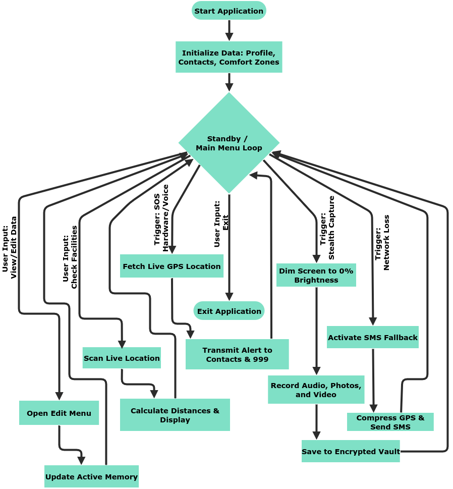
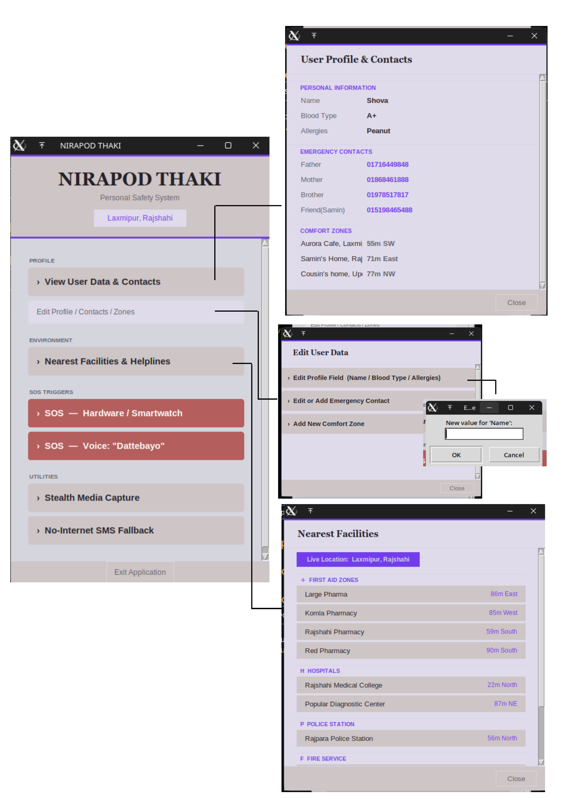
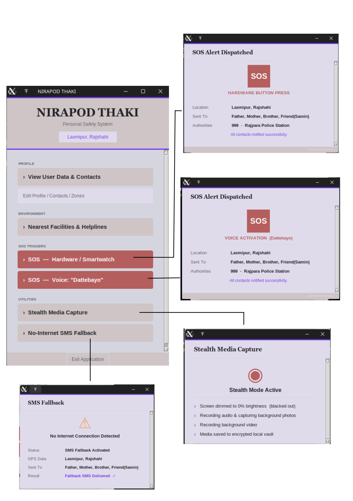

# Nirapod Thaki: A Quick Emergency Response and Safety App

> **Project Scope (Proof of Concept)** > *Note: This application was developed as an interactive Proof of Concept (PoC) and Simulated Prototype. To demonstrate the core logic and user flow without requiring heavy external costs or server hosting, the app simulates live network features. GPS tracking, database storage, and external API calls (like SMS gateways) are faked using hardcoded environment variables and timed logic delays. This allowed our team to successfully design, test, and present the safety framework of the app entirely offline.*

---

## 1. The Problem We Are Solving
In Bangladesh, crimes like kidnapping, robbery, and harassment are increasing, making people—especially women and children—feel unsafe in their daily lives. During an emergency, a victim usually does not have the time to take out their phone, unlock it, call the police, and explain where they are. Also, many criminals get away because there is no solid proof of the crime. We needed to build a fast, hidden way to call for help and collect evidence without alerting the attacker.

## 2. Why We Built This (Motivation)
Our goal is to give people a "digital safety net." We built "Nirapod Thaki" so that anyone in danger can instantly alert their family and the police, even if their phone is in their pocket. By using simple triggers like a voice command or a button press, the app helps victims get rescued faster and secretly records the proof they need to get legal justice.

## 3. How The App Works (The Algorithm)
The app follows a simple, step-by-step logic to keep the user safe:
1. **Setup:** When the app opens, it loads the user's personal details, emergency contacts, and safe comfort zones.
2. **Standby:** The app stays quiet in the background, keeping track of the nearest hospitals and police stations based on the live location.
3. **The SOS Trigger:** The user signals for help using a voice command (like saying "Dattebayo") or pressing a hardware button (like a smartwatch or phone volume button).
4. **Instant Alerts:** The app immediately sends the user's live location to all family contacts and local authorities (999).
5. **Stealth Evidence Capture:** The phone screen goes completely dark so it looks turned off. In the background, it secretly records audio, takes photos, and records video to save as evidence.
6. **No-Internet Backup:** If the user has no Wi-Fi or data connection, the app automatically switches to SMS and texts the location to the emergency contacts.

### System Flowchart

---

## 4. Application Screenshots
*(Note: Visual prototype of the Tkinter GUI system)*

  

---

## 5. Discussion & Challenges
* **Performance:** The app is designed to be very fast. It doesn't use a lot of phone memory, which means it will run smoothly even on older or cheaper smartphones.
* **Technical Challenges:** The hardest part of making this app is dealing with phone security rules. Operating systems (like Android) try to stop apps from using the camera or microphone while the screen is off, so building the "Stealth Mode" required clever workarounds.
* **How We Built It:** Our team wrote all the core Python code and emergency logic entirely from scratch. To make the app look good and finish it on time, we used AI-assisted prototyping tools to help generate the Tkinter visual layout, allowing us to focus on the backend safety functionality.

---

## 6. Team Management

| Name | Role | Responsibilities |
| :--- | :--- | :--- |
| **Mst. Ashmery Shova** | Idea Presenter | Came up with the idea for the SOS app, figured out what problem we were solving, and planned the main features. |
| **All Shad** | App Designer | Designed how the app looks, making sure the buttons are easy to find and use during a stressful emergency. |
| **Supantha Krishna Das** | Lead Programmer | Wrote the Python code, built the emergency logic, and connected all the features to make the app actually work. |
| **Tareq Rahman Samin** | App Tester | Tested the app in fake real-world emergencies to find bugs, fix errors, and make sure the SOS alerts send correctly. |
